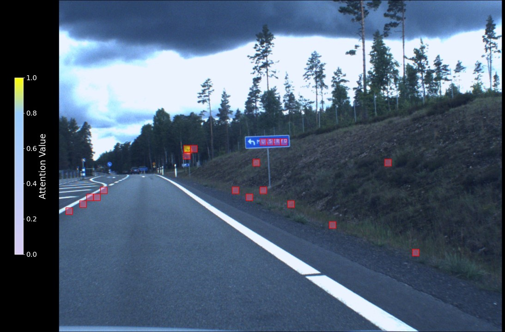
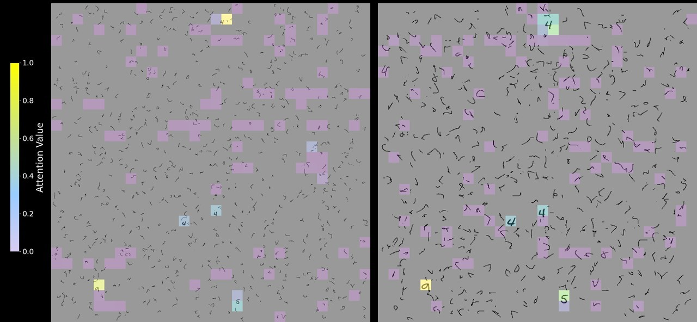
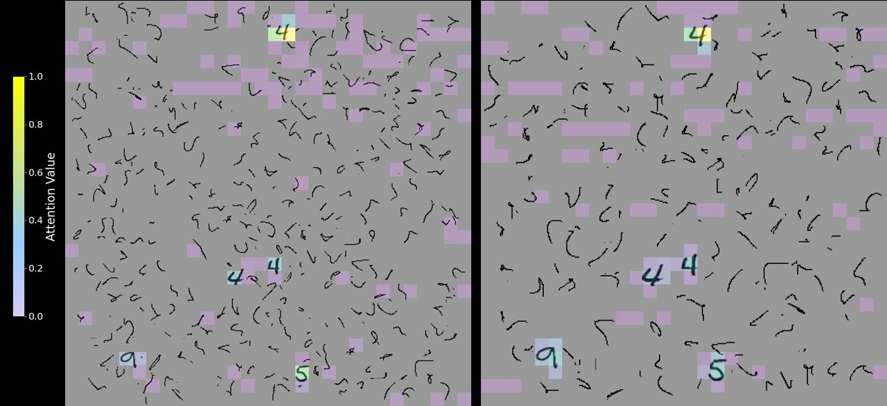

<h1 align="left">
    On the Generalizability  
    of Iterative Patch Selection  
    for High-Resolution Image Classification
</h1>

## 📚 Summary
Classifying large images with small or tiny regions of interest (ROI) in computer vision is challenging due to computational and memory constraints. Weakly supervised memory-efficient patch selectors have achieved results comparable to strongly supervised methods. However, low signal-to-noise ratios and low entropy attention still cause overfitting. We explore these issues using a novel testbed based on a memory-efficient cross-attention transformer with Iterative Patch Selection (IPS) as the patch selection module. Our testbed extends the megapixel MNIST benchmark to different O2I (object-to-image) ratios while keeping the canvas size fixed and introducing a novel noise generation component. Experimental results indicate that the O2I threshold below which IPS fails to generalize is affected by both the task and the training dataset size. Further outcomes reveal that tuning the patch size to be smaller relative to the ROI improves generalization and lowers memory requirements in low data/O2I settings. Contributing to similar work, we find that as the distribution of the noise component gets closer to the region of interest, IPS fails to converge on both training and validation sets, showing almost random accuracies. 

**Note:** All features can be activated and deactivated via the config files.

## 📁 Repository Structure

### 1.  Architecture
- **`ips_net.py`**: Script where iterative patch selection is performed, including the initial encoding stage.
- **`transformer.py`**: Script defining the multi-head cross-attention pooling operator, attention scorer, and multi-layer perceptron.

### 2. Training
- **`iterative.py`**: Defines the loss functions, initializes batches, and handles training for one epoch.

### 3. Main Script
- **`main.py`**: The main script that orchestrates the entire process.

### 4.  Configuration Files
- **`mnist_config.yml`**: Configuration file for the MNIST dataset.
- **`camelyon_config.yml`**: Configuration file for the Camelyon dataset.
- **`traffic_config.yml`**: Configuration file for the Traffic dataset.

### 5.  Data Processing
**Megapixel MNIST**
- **`make_mnist.py`**: Original MegaMNIST generation script.
- **`PineneedleMegaMNIST.py`**: Custom data generation script with new Bezier noise and Object-to-Image (O2I) setup.
- **`mnist_dataset.py`**: Script to preprocess and patchify the data.

### 6. Utilities
- **`utils.py`**: Contains functions for logging memory, adjusting the learning rate, and printing statistics.

### 7. Results Library
The results are organized into the following categories:
- **`O2I_datasize`**: Results related to Object-to-Image (O2I) ratio and dataset size.
- **`Semantic_Diversity_Regularisation`**: Results related to semantic diversity regularization.
- **`Attention_Masking`**: Results related to attention masking.
- **`Dataset_Size`**: Results focusing on different dataset sizes.
- **`Noise_Size`**: Results focusing on the size and impact of noise.
- **`Digit_Thickness`**: Results related to the thickness of digits.
- **`Backbones`**: Results related to different backbone architectures.
- **`Patch_Size`**: Results focusing on the size of patches used in training.

**Note:** The naming convention for results is as follows:

**Example:** `results_84_84_3000_3000_400n_1000d_PS_50`
- This denotes 84x84 digit resolution on a 3000x3000 canvas with 400 noise points and 1000 training data points, with a patch size of 50.

## Swedish traffic Signs data set

    

<strong>Figure 3:</strong> Attention maps for image 63 (validation set) of the Swedish traffic Signs data set. IPS was run for 140 epochs with a patch size and stride of 25

## Megapixel MNSIT

    

<strong>Figure 3:</strong> Attention maps for different object-to-image ratios: 0.008% (left) and 0.034% (right) on a 1500 × 1500 canvas, with 800 noise digits on the left and 600 on the right. The maps display the top M (100) most informative patches at the end of a full forward pass with IPS. The digit and noise size on the left is 28 × 28 and on the right 56 × 56.

    

<strong>Figure 4:</strong> Attention maps for different object-to-image ratios: 0.078% (left) and 0.13% (right) on a 1500 × 1500 canvas, with 400 noise digits on the left and 200 on the right. The maps display the top M (100) most informative patches at the end of a full forward pass with IPS. The digit and noise size on the left is 84 × 84 and on the right 112 × 112.

