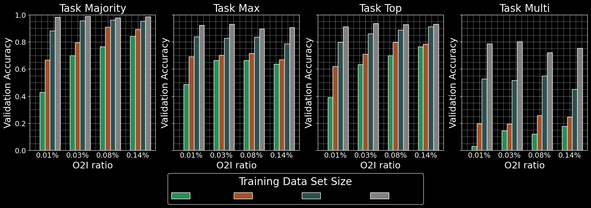

# Summary

This repository contains the code for my dissertation, which adapts the IPS approach from [benbergner/ips](https://github.com/benbergner/ips.git). IPS is a simple patch-based method that decouples memory consumption from input size, enabling efficient processing of high-resolution images without running out of memory.

We performed repeated experiments with the Megapixel MNIST dataset, sourced from [idiap/attention-sampling](https://github.com/idiap/attention-sampling.git). The experiments varied object-to-image ratio, training size, noise generation strategy, pretraining strategy, and different previously introduced masking strategies to robustify the patch-based image classifier in scenarios with low data and small object-to-image ratios.

## Repository Structure
```
├── architecture/
│ ├── ips_net.py # Script where iterative patch selection is performed, including the initial encoding stage
│ └── transformer.py # Script defining the multi-head cross attention pooling operator, attention scorer, and multi-layer perceptron
│
├── config/
│ ├── mnist_config.yml
│ ├── camelyon_config.yml
│ └── traffic_config.yml
│
├── data/
│ ├── megapixel_mnist/
│ │ ├── make_mnist.py # Original MegaMNIST generation script
│ │ ├── PineneedleMegaMNIST.py # Our version of the data generation with new Bezier noise and O2I setup
│ │ └── mnist_dataset.py # Script to preprocess and patchify the data
│
├── results_library/
│ ├── 1) O2I_datasize
│ ├── 2) Semantic_Diversity_Regularisation
│ ├── 3) Attention_Masking
│ ├── 4) Dataset_Size
│ ├── 5) Noise_Size
│ ├── 6) Digit_Thickness
│ ├── 7) Backbones
│ └── 8) Patch_Size
│
│ Note: The naming convention of the results is as follows:
│ results_(digit_size_x)(digit_size_y)(canvas_size_x)(canvas_size_y)(number_of_noise)(number_of_training_data_points)(regularisation_and_special_feature)
│
│ Example: results_84_84_3000_3000_400n_1000d_PS_50
│ This denotes 84x84 digit resolution on a 3000x3000 canvas with 400 noise points and 1000 training data points, with a patch size (PS) of 50.
│
├── utils/
│ └── utils.py # Includes functions for logging memory, adjusting the learning rate, and printing stats
│
├── training/
│ └── iterative.py # Defines the loss functions, initializes batches, and handles training for one epoch
│
└── main.py # Main script
```
## Contributions

Our contributions that build upon the implementation by [benbergner/ips](https://github.com/benbergner/ips.git) are as follows:

1. Adding a data generation script `PineneedleMegaMNIST.py` with updated noise and O2I varying strategy.
2. Including semantic and diversity loss features in the `iterative.py` script.
3. Adding stochastic attention masking features in `ips_net.py`.
4. Introducing a new backbone strategy with ResNet-50, freezing all weights until the last layer in `ips_net.py`.
5. Contributed a script to inference producing attention maps

## Noise Generation

<div align="center">
    
</div>

## Findings

### Object-to-Image Ratio

<div align="center">
    
</div>

<div align="center">
    
</div>

<div align="center">
    
</div>

**Note:** All features can be activated and deactivated via the config files.

